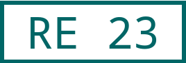
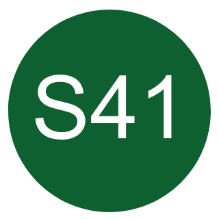

# Public transport line colors
This repository is made for collecting line colors in public transport lines,
so they can be displayed on systems using DB HAFAS.

## Contents

- [Line Colors](#line-colors)
- [Product Categories](#product-categories)

## Line Colors

### Structure

The `line-colors.csv` contains several columns:
- `shortOperatorName`: Short operator name (i.e. vehicle keeper marking/"Halterkürzel" or another identifier for EVU) and a local transport network abbreviation
- `lineName`: Displayed line name
- `hafasOperatorCode`: used to identify the correct line, if line id is not distinct. Can be empty!
- `hafasLineId`: identifies the HAFAS line - you can get this by requesting a departure for the line from HAFAS (i.e. using [db-rest playground](https://petstore.swagger.io/?url=https%3A%2F%2Fv6.db.transport.rest%2F.well-known%2Fservice-desc%0A))
- `backgroundColor`: Color-Hexcode for the display background color
- `textColor`: Color-Hexcode for the text color
- `borderColor` Color-Hexcode for the border of the shape
- `shape`: Specifies the shape of the icon --> see examples below
  - `circle`: Just a circle
  - `hexagon` A pill with pointy tips
  - `rectangle`: Just a rectangle
  - `rectangle-rounded-corner`: Rectangle with rounded corners
  - `pill`: Rectangle with completely rounded corners
  - `trapezoid` A trapezoid shape with a broad top and a narrow bottom side
- `wikidataQid`: Wikidata QID for the line (if available, can be empty)
- `productCategory`: An optional `productCategory` from the Product Categories database in order to manually assign a particular Product Category override. This is useful if e.g. an operator runs a single line entering another traffic association using different branding, such as DB Regio operating for Austrian S-Bahn networks.

### Contributing

If a line operates in a local transport network/"Verkehrsverbund", the network's line color shall be preferred.<br>
Local transport networks usually have line colors for:

- suburban lines / "S-Bahn"
- subway lines / "U-Bahn"
- tramway lines / "Straßenbahn, Stadtbahn"
- bus lines / "Bus"

If a single line operates in **multiple** transport networks, the color communicated by the operator shall be preferred.

I'd be very happy if this file could expand very fast, so please feel free to add more lines by opening a PR. <br>
Please keep the PR's small. If possible, create a small PR for each operator. <br>

**BUT FIRST**

- Check that entries are sorted first by `shortOperatorName` and then `lineName`
- Reference a source in your PR where data can be proved (somewhere from the internet, like a timetable PDF...)
    - Also add it to `sources.json`.
- All entries in the CSV (except `lineName`) shall be in lower case

**THEN**

- Please checkout at the latest commit of the `main` branch and create a new branch from there
- Ensure that the validation tests (after pr is created) pass

**optionally but recommended: Wikidata ([why?](https://github.com/Traewelling/line-colors/issues/91))**

- try to find the Wikidata QID for the line and add it to the `wikidataQid` column
    - You can use [this list](https://www.wikidata.org/wiki/User:Mkkagain/Verkehrslinien_in_Deutschland) to find the QID
- if there is no Wikidata item for the line, it would be great if you could [create one](https://www.wikidata.org/wiki/Special:NewItem)

### Examples

### Die Länderbahn GmbH DLB, RE72


<br>

- `shortOperatorName`: alex-dlb
- `lineName`: RE 23
- `hafasOperatorCode`: alex-die-landerbahn-gmbh-dlb
- `hafasLineId`: re23
- `backgroundColor`: #ffffff
- `textColor`: #006666
- `borderColor` #006666
- `shape`: rectangle
- `wikidataQid` Q130542294

Entry: `alex-dlb,RE 23,alex-die-landerbahn-gmbh-dlb,re23,#ffffff,#006666,#006666,rectangle,Q130542294`

### DB Regio AG S-Bahn München, S7

<br>

- `shortOperatorName`: mvv-db-sbm
- `lineName`: S7
- `hafasOperatorCode`: db-regio-ag-s-bahn-munchen
- `hafasLineId`: 4-800725-7
- `backgroundColor`: #8a372f
- `textColor`: #ffffff
- `borderColor` *does not apply*
- `shape`: pill
- `wikidataQid` *not available*

Entry: `mvv-db-sbm,S7,db-regio-ag-s-bahn-munchen,4-800725-7,#8a372f,#ffffff,,pill,`

### KVV: Albtal-Verkehrs-Gesellschaft mbH, S1


<br>

- `shortOperatorName`: kvv-avg
- `lineName`: S1
- `hafasOperatorCode`: albtal-verkehrs-gesellschaft-mbh
- `hafasLineId`: 4-a6s8-8
- `backgroundColor`: #6e692a
- `textColor`: #ffffff
- `borderColor` *does not apply*
- `shape`: rectangle-rounded-corner (a pill with less rounded corners)
- `wikidataQid` *not available*

Entry: `kvv-avg,S8,albtal-verkehrs-gesellschaft-mbh,4-a6s8-8,#6e692a,#ffffff,,rectangle-rounded-corner,`

### HVV: Hadag, 62


<br>

- `shortOperatorName`: hvv-had
- `lineName`: 62
- `hafasOperatorCode`: *not available*
- `hafasLineId`: 6-hvvhad-62
- `backgroundColor`: #009bb6
- `textColor`: #ffffff
- `borderColor` *does not apply*
- `shape`: trapezoid (a shape with a broad top and a narrow bottom side)
- `wikidataQid` *not available*

Entry: `hvv-had,62,,6-hvvhad-62,#009bb6,#ffffff,,trapezoid,`

#### HVV: Hamburger Hochbahn AG, X35


<br>

- `shortOperatorName`: hvv-hha
- `lineName`: X35
- `hafasOperatorCode`: *not available*
- `hafasLineId`: 5-hvvhha-x35
- `backgroundColor`: #eb452e
- `textColor`: #ffffff
- `borderColor` *does not apply*
- `shape`: hexagon (a pill with pointy tips)
- `wikidataQid` *not available*

Entry: `hvv-hha,X35,,5-hvvhha-x35,#eb452e,#ffffff,,hexagon,`

#### S-train Liege: SNCB, S41


<br>

- `shortOperatorName`: liege-s
- `lineName`: S41
- `hafasOperatorCode`: sncb
- `hafasLineId`: 4-88-41
- `backgroundColor`: #0f6030
- `textColor`: #ffffff
- `borderColor` #ffffff
- `shape`: circle
- `wikidataQid` *not available*

Entry: `liege-s,S41,sncb,4-88-41,#0f6030,#ffffff,#ffffff,circle,`

## Product Categories (alpha)

In addition to the line schematics, this repository also collects Product Categorying data for transport operators.

This is particularly useful when applications want to provide an authentic look and feel about train or transport
categories to users - independent of individual lines.

### Structure

- `productCategory`: a meaningful name matching the Product Category, such as `cd-railjet`, `sncf-ouigo` or `s-bahn-at`
- `hafasOperatorCode`: the operator code as in HAFAS. An empty String will *never* match (useful for manual assignments).
- `product`: the product String from HAFAS, such as `suburban`, `national` or `bus`. An empty String will *never* match (useful for manual assignments).
- `productName`: the productName String from HAFAS, such as `TGV` or `S`. An empty String will *never* match (useful for manual assignments).
- `shortName`: should be empty. An *optional* override to the [Wikidata short name](https://www.wikidata.org/wiki/Property:P1813). Only specify if unavailable in Wikidata or not meaningful.
- `iconName`: should be empty. An *optional* override for the [Wikidata logo image](https://www.wikidata.org/wiki/Property:P154). Only specify if unavailable in Wikidata or not meaningful. In case specified, the icon **must** be included into the [`icon-sources.json`](icon-sources.json) with corresponding source and attribution.
- `wikidataQid`: **mandatory** Wikidata QID for the product or anything to be considered as data source. If you don't find anything, maybe just create the dataset.

#### Adding Product Categories

For simple Product Categories present in Wikidata, this should be easy. Simply fill in a new row in the `product-categories.csv`.

In case you happen to add a manual `iconName` property and a corresponding SVG, please ensure to normalize the SVG and list its source in `icon-sources.json` before committing.

You can normalize the SVG by installing `librsvg` and `svgcleaner`. Then execute:

```shell
rsvg-convert -f svg -a -h 24 -o your-icon.svg your-icon.svg
svgcleaner your-icon.svg your-icon.svg
```

In case you are unfamiliar with command prompt, just upload the icon as attachment to your PR and ask a reviewer to assist you.
